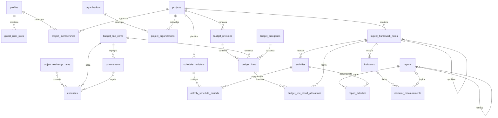

# Modello dati — Milestone 2

Data: 7 ottobre 2026. Versione 2: indicazioni dell’utente recepite.
**Stato: modello approvato, Milestone 2 conclusa; consegna versionata su `main`.
Migration fondative introdotte dalla [Milestone 3](milestone-3.md),
verificate in isolamento e applicate al backend dedicato il 7 ottobre 2026.**

Questa specifica dettaglia le sezioni 4–6 della [roadmap](roadmap-gestione-progetti.md).
Le scelte sotto recepiscono le indicazioni riportate dall’utente nella consegna.
I dettagli tecnici traducono tali indicazioni in un contratto per le future migration.
La [matrice dei permessi](permissions.md) è parte integrante del modello.
La [consegna](milestone-2.md) riporta verifiche e criterio di chiusura.

## 1. Scelte concordate e confini

| Tema | Proposta per la prima versione | Alternativa e conseguenza |
| --- | --- | --- |
| Organizzazioni | Una piattaforma, progetti condotti da enti diversi: un ente singolo oppure capofila e partner | Gli enti non sono tenant: l’accesso dipende dalle assegnazioni ai progetti |
| Quadro logico | Modello ibrido con un solo padre; attività separate collegate a un risultato | Relazioni molti-a-molti e sotto-attività rinviate |
| Indicatori | Assoluto o rapporto; rilevazioni canoniche uniche | Dati registrati da Manager/Admin immediatamente validati |
| Revisioni | Snapshot completi e immutabili di budget e cronogramma pubblicati | Manager assegnato e Admin possono pubblicare, senza secondo approvatore |
| Valute | Valuta principale del finanziamento; primo progetto in EUR; spese anche in altre valute | Conversione con tasso medio mensile; frequenza giornaliera e acquisizione automatica futura |
| Ruoli MVP | Solo Admin globale e Manager assegnato | Operator e viewer esclusi da schema, policy e UI MVP; requisiti da definire in seguito |
| Storico | Audit e revisioni; archiviazione, rettifiche dei dati registrati | Nessuna sovrascrittura distruttiva dello storico |

Lingua UI, allegati, notifiche e task restano alle milestone funzionali.
Le regole tecniche sui cambi sono descritte nella sezione 7: aggiornare il mese
corrente non deve alterare silenziosamente spese già registrate.

## 2. Convenzioni del dizionario

- Nomi SQL inglesi in `snake_case`; PK `id uuid` salvo eccezioni esplicite.
- `!` indica NOT NULL; `?` indica nullable; `→` indica una FK. I campi elencati
  includono la PK e il gruppo comune dove indicato.
- `A` = `created_at timestamptz!`, `created_by uuid? → profiles`,
  `updated_at timestamptz!`, `updated_by uuid? → profiles`, `row_version bigint!`.
  Timestamp e autori sono assegnati dal database; autore nullo solo per bootstrap
  o processi di sistema identificati nell'audit. `row_version` parte da 1 e aumenta
  a ogni modifica; le scritture confrontano la versione letta per evitare perdite.
- `P` = `id uuid! PK`, `project_id uuid! → projects`, `A`,
  vincolo `UNIQUE(project_id, id)`. Tutte le FK fra dati di progetto includono
  `project_id`: una FK sul solo UUID non prova l'appartenenza allo stesso progetto.
- Quantità e rapporti: `numeric(20,6)`; denaro: `numeric(20,6)` per importi originali, `numeric(18,2)` per EUR e importi della
  valuta principale nella prima versione; mai floating point. Valute principali
  con precisione diversa da due decimali richiedono un’estensione prima dell’uso.
  Rifiutare valori non finiti e importi/quantità negativi nei domini qui previsti.
- Date operative `date`; istanti di audit `timestamptz` in UTC. Intervalli di date
  inclusivi con fine ≥ inizio. Testi obbligatori non vuoti dopo trim.
- Stati/tipi/ruoli: inizialmente `text` con CHECK su valori chiusi qui elencati;
  nessuna tabella `roles` editabile e nessun enum PostgreSQL necessario nella v1.
- FK con RESTRICT per la cancellazione; utenti disabilitati, non rimossi. La
  cancellazione degli account Auth richiede una procedura successiva di conservazione
  dello storico. Nessuna cascata che cancelli budget, rapporti o audit.
- Progetti archiviati sono in sola lettura (Admin o Manager assegnato può riaprirli con audit).
  Le entità archiviate mantengono riferimenti e storico; niente nuovi riferimenti
  a entità archiviate, salvo la copia di snapshot storici. La composizione degli enti può essere aggiornata
  dal Manager tramite operazione transazionale; rimozioni di associazioni preservate
  nell’audit e subordinate ai vincoli del partenariato.
- Le regole che coinvolgono altre righe o tabelle richiedono FK composte, trigger
  o operazioni transazionali nel DB: non basta validarle nel form o con RLS.

## 3. Relazioni principali

Il diagramma riassume le relazioni; il dizionario sotto specifica tutte le tabelle.

## 4. Identità, progetti e accessi

| Tabella | Campi | Vincoli e significato |
| --- | --- | --- |
| `profiles` | `id uuid! PK → auth.users.id`, `display_name text!`, `is_active boolean!` (true), `A` | Profilo creato dal flusso Auth controllato; email e credenziali restano in Auth. L'utente modifica soltanto il proprio nome, mai lo stato |
| `global_user_roles` | `user_id uuid! PK → profiles`, `role text!` (`admin`), `A` | Zero o una riga per utente; assegnazione solo admin, bootstrap fuori dal client; vietato disabilitare/rimuovere l'ultimo admin attivo |
| `projects` | `id uuid! PK`, `code text!`, `title text!`, `description text?`, `status text!`, `start_date date!`, `end_date date!`, `donor text?`, `currency_code text!`, `notes text?`, `A` | Codice univoco normalizzato maiuscolo; stati `draft/active/completed/archived`; valuta di 3 lettere da elenco ammesso dall'applicazione; non cambiare valuta dopo il primo dato economico |
| `project_memberships` | `P`, `user_id uuid! → profiles`, `role text!` (`manager`), `status text!` | `UNIQUE(project_id,user_id)`; stati `active/inactive`; assegnazioni gestite da Admin |
| `organizations` | `id uuid! PK`, `code text!`, `name text!`, `country_code text?`, `status text!`, `A` | Codice univoco normalizzato; stati `active/archived`; anagrafica condivisa della piattaforma, gestita da Admin |
| `project_organizations` | `P`, `organization_id uuid! → organizations`, `role text!`, `notes text?` | `UNIQUE(project_id,organization_id)`; ruolo `sole/lead/partner`; Manager gestisce composizione dei propri progetti scegliendo enti esistenti |

Un progetto draft può avere composizione incompleta. Per attivarlo deve avere
esattamente un ente `sole`, senza altri enti, oppure esattamente un `lead` e
almeno un `partner`. Indice univoco parziale sul progetto per i ruoli sole/lead,
e controllo differito sotto lock del progetto per tutte le modifiche alla
composizione e allo stato. La stessa organizzazione può partecipare a più progetti
con ruoli diversi. Cambiare partenariato è tracciato nell’audit.

L’organizzazione non attribuisce accessi ai suoi utenti: solo Admin assegna Manager
ai progetti. Un Manager vede l’anagrafica degli enti collegati ai propri progetti;
la ricerca degli enti per aggiungerli restituisce solo id, codice e nome tramite
API controllata, senza rivelare altri progetti o partenariati. Un nuovo ente viene
creato da Admin, evitando che un Manager modifichi anagrafiche condivise.

Non memorizzare il ruolo globale in campi modificabili del profilo o in metadata
forniti dal client. Profilo disabilitato revoca ogni accesso; membership inattiva
revoca quello al progetto. Admin crea/invita gli utenti tramite Auth e assegna
le membership. Il Manager legge e scrive tutti i dati dei progetti assegnati,
compresi budget, rapporti e piani; non crea progetti, utenti o assegnazioni.
Non introdurre `activity_assignments`, ruoli operator/viewer o flag budget nell’MVP.

## 5. Quadro logico, attività e indicatori

| Tabella | Campi | Vincoli e significato |
| --- | --- | --- |
| `logical_framework_items` | `P`, `parent_id uuid? → logical_framework_items`, `type text!`, `code text!`, `title text!`, `description text?`, `assumptions text?`, `sort_order integer!`, `status text!` | `UNIQUE(project_id,code)`; tipi `general_objective/specific_objective/expected_result`; stati `active/archived`; ordine ≥ 0, pareggi ordinati per id |
| `activities` | `P`, `result_id uuid! → logical_framework_items`, `code text!`, `title text!`, `description text?`, `status text!`, `priority text!`, `sort_order integer!`, `notes text?` | `UNIQUE(project_id,code)`; risultato obbligatorio; stati `planned/in_progress/completed/cancelled/archived`; priorità `low/normal/high`; ordine ≥ 0 |
| `indicators` | `P`, `framework_item_id uuid! → logical_framework_items`, `code text!`, `title text!`, `description text?`, `verification_source text!`, `type text!`, `unit text!`, `aggregation_method text!`, `direction text!`, `ratio_scale numeric!`, `baseline_date date?`, `baseline_value numeric(20,6)?`, `baseline_numerator numeric(20,6)?`, `baseline_denominator numeric(20,6)?`, `target_date date?`, `target_value numeric(20,6)?`, `target_numerator numeric(20,6)?`, `target_denominator numeric(20,6)?`, `status text!` | `UNIQUE(project_id,code)`; tipi `absolute/ratio`; stati `draft/active/archived`; direzione `increase/decrease`; scala 1 o 100, scala 1 per absolute |
| `indicator_measurements` | `P`, `indicator_id uuid! → indicators`, `activity_id uuid? → activities`, `source_report_id uuid? → reports`, `period_start date!`, `period_end date!`, `value numeric(20,6)?`, `numerator numeric(20,6)?`, `denominator numeric(20,6)?`, `source_note text?`, `supersedes_measurement_id uuid? → indicator_measurements`, `status text!`, `validated_by uuid? → profiles`, `validated_at timestamptz?` | Stati `draft/validated`; una rilevazione per `(project_id,source_report_id,indicator_id,activity_id)` quando proviene da rapporto; rilevazioni manuali con fonte obbligatoria |

### Gerarchia e modifiche strutturali

Un obiettivo generale non ha padre. Uno specifico ha esattamente un generale;
un risultato ha esattamente uno specifico. Tutti nello stesso progetto.
Questi livelli escludono cicli; controllare anche gli UPDATE del padre e del tipo.
Attività riferite soltanto a risultati. Una volta referenziato, un elemento non
cambia tipo; reparenting nello stesso progetto ammesso solo se non invalida
rilevazioni/rapporti esistenti. `project_id` è immutabile per ogni entità.

L'indicatore misura un elemento del quadro logico. Se una rilevazione ha
`activity_id`, il suo indicatore deve riferirsi al risultato dell'attività o a
uno dei suoi antenati. Una modifica strutturale che renderebbe incoerente questa
relazione è respinta; si archivia e si crea una nuova definizione.

### Valori, baseline, target e aggregazioni

Per absolute è valorizzato solo `value`; per ratio solo numeratore e denominatore,
con denominatore > 0. La stessa esclusività vale per baseline e target.
In bozza sono ammessi gruppi baseline/target interamente nulli, mai parziali;
per attivare l'indicatore servono baseline, target e rispettive date, con
`target_date >= baseline_date`. Numeratore ≤ denominatore non è un vincolo
universale: alcuni rapporti possono superare 1. Percentuale = `100 × n/d`.

Metodi ammessi: absolute `sum/last/mean`; ratio `ratio_of_sums/last`.
Per ratio non si fa la media semplice delle percentuali. Somma dei numeratori
sulla somma dei denominatori: 20/100 e 30/50 danno 50/150 = 33,33%, non 40%.
`mean` è media aritmetica non ponderata e richiede osservazioni omogenee.
`last` sceglie la maggiore `period_end`; i pareggi usano `validated_at`, poi id,
con ordinamento esplicito. Non equivale a una somma cumulativa.

Per un intervallo richiesto si includono solo osservazioni completamente contenute
nell'intervallo; quelle a cavallo sono segnalate, mai ripartite proporzionalmente.
Per `last` si usa l'ultima osservazione conclusa entro la data di riferimento.
Baseline e target non si sommano alle rilevazioni. Senza valori validati il risultato
è nullo («nessun dato»), non zero. Per percentuale di raggiungimento rispetto
alla baseline usare `(corrente-baseline)/(target-baseline) × 100`; target uguale
alla baseline rende questa metrica non definita. Non troncare i valori oltre 100%.

`sum` e `ratio_of_sums` richiedono contributi additivi, non cumulativi: periodi
sovrapposti tra attività possono essere legittimi, ma il Manager/Admin che registra deve escludere
la doppia conta delle stesse persone/eventi. Il modello non contiene anagrafiche
beneficiari e non può deduplicarle automaticamente. Per serie cumulative usare
`last`. Type, unità, scala, aggregazione, baseline e target sono congelati dopo
la prima rilevazione validata; cambi metodologici richiedono un nuovo indicatore,
archiviando il precedente. Target temporali multipli restano fuori dalla v1.

### Un'unica fonte quantitativa

`indicator_measurements` è la sola tabella dei valori osservati.
`report_indicator_values` e `indicator_contributions` della roadmap non diventano
copie fisiche: potranno essere viste filtrate delle rilevazioni, con gli stessi
permessi. Per una rilevazione da rapporto sono obbligatori `activity_id` e il
collegamento composto `(project_id, source_report_id, activity_id)` a
`report_activities`. Periodo uguale al periodo del rapporto.
Stato e validatore sono allineati al rapporto nella stessa transazione, mai
modificabili separatamente. La registrazione da Manager/Admin valida automaticamente
i dati, anche propri; `validated_by` identifica chi registra.

Concorrono alle metriche soltanto rilevazioni validate, non sostituite da una
rettifica validata. Per le manuali escludere il predecessore solo quando la sua rettifica è validata.
Un indicatore archiviato conserva i suoi valori storici;
archiviare l'indicatore ne vieta nuove rilevazioni, non cancella i risultati.

## 6. Cronogramma e revisioni

| Tabella | Campi | Vincoli e significato |
| --- | --- | --- |
| `schedule_revisions` | `P`, `revision_number integer!`, `based_on_id uuid? → schedule_revisions`, `title text!`, `reason text!`, `status text!`, `approved_by uuid? → profiles`, `approved_at timestamptz?` | `UNIQUE(project_id,revision_number)`; numero ≥ 1; stati `draft/approved`; prima versione approvata = piano iniziale; base dello stesso progetto |
| `activity_schedule_periods` | `P`, `revision_id uuid! → schedule_revisions`, `activity_id uuid! → activities`, `period_key uuid!`, `start_date date!`, `end_date date!`, `title text!`, `status text!`, `notes text?` | `UNIQUE(project_id,revision_id,period_key)`; stati `planned/cancelled`; più periodi per attività; key stabile fra copie della revisione |
| `project_schedule_state` | `project_id uuid! PK → projects`, `initial_revision_id uuid! → schedule_revisions`, `current_revision_id uuid! → schedule_revisions`, `A` | Entrambe FK composte con progetto; puntano solo a revisioni approvate; riga assente prima della prima approvazione |

Snapshot completi: una nuova bozza copia i periodi del piano corrente preservando
`period_key`; un periodo nuovo riceve una nuova key. La key non cambia attività
fra revisioni. Per eliminare un periodo dalla pianificazione successiva lo si
mantiene con stato cancelled; lo snapshot iniziale resta consultabile.
Periodi oltre le date del progetto respinti alla pubblicazione; una modifica
delle date del progetto non può escludere periodi del piano corrente.
Sovrapposizioni della stessa attività sono ammesse e segnalate per revisione.

La prima pubblicazione imposta entrambi i puntatori; le successive cambiano solo
il corrente. Numero progressivo assegnato sotto lock del progetto; una sola bozza
per progetto. Manager assegnato o Admin può pubblicare anche la propria bozza:
lo stato `approved` indica il piano reso ufficiale, senza un secondo approvatore.
`approved_by/at` identificano chi pubblica e quando. La pubblicazione congela
contenuto e metadati, aggiorna il puntatore e scrive l’audit in una transazione.
Una bozza basata su un corrente superato richiede riallineamento prima di pubblicare.

## 7. Budget, impegni e spese

| Tabella | Campi | Vincoli e significato |
| --- | --- | --- |
| `budget_categories` | `P`, `code text!`, `name text!`, `sort_order integer!`, `status text!` | `UNIQUE(project_id,code)`; ordine ≥ 0; stati `active/archived`; categorie locali al progetto |
| `budget_line_items` | `P`, `code text!`, `status text!` | `UNIQUE(project_id,code)`; identità stabile della voce fra revisioni, stati `active/archived` |
| `budget_revisions` | `P`, `revision_number integer!`, `based_on_id uuid? → budget_revisions`, `title text!`, `reason text!`, `status text!`, `approved_by uuid? → profiles`, `approved_at timestamptz?` | `UNIQUE(project_id,revision_number)`; numero ≥ 1; stati `draft/approved`; stesse regole di transizione dei piani |
| `budget_lines` | `P`, `revision_id uuid! → budget_revisions`, `line_item_id uuid! → budget_line_items`, `category_id uuid! → budget_categories`, `category_name_snapshot text!`, `description text!`, `planned_amount numeric(18,2)!`, `notes text?` | `UNIQUE(project_id,revision_id,line_item_id)`; importo ≥ 0; nome categoria fissato nello snapshot alla pubblicazione |
| `budget_line_result_allocations` | `P`, `budget_line_id uuid! → budget_lines`, `result_id uuid! → logical_framework_items`, `amount numeric(18,2)!` | `UNIQUE(project_id,budget_line_id,result_id)`; solo risultati, importo > 0 |
| `project_budget_state` | `project_id uuid! PK → projects`, `initial_revision_id uuid! → budget_revisions`, `current_revision_id uuid! → budget_revisions`, `A` | Puntatori composti a revisioni approvate dello stesso progetto, come per il cronogramma |
| `commitments` | `P`, `line_item_id uuid! → budget_line_items`, `reference text!`, `description text!`, `commitment_date date!`, `amount numeric(18,2)!`, `status text!`, `closed_at timestamptz?`, `notes text?` | `UNIQUE(project_id,reference)`; importo > 0; stati `draft/confirmed/closed/cancelled` |
| `expenses` | `P`, `line_item_id uuid! → budget_line_items`, `commitment_id uuid? → commitments`, `reference text!`, `description text!`, `payment_date date!`, `original_currency_code text!`, `original_amount numeric(20,6)!`, `exchange_rate_id uuid? → project_exchange_rates`, `applied_rate numeric(24,12)?`, `amount numeric(18,2)?`, `status text!`, `posted_by uuid? → profiles`, `posted_at timestamptz?`, `void_reason text?`, `notes text?` | `UNIQUE(project_id,reference)`; importo > 0; stati `draft/posted/voided`; FK composta `(project_id,commitment_id,line_item_id)` all'impegno se presente |

### Cambi medi mensili

| Tabella | Campi | Vincoli e significato |
| --- | --- | --- |
| `project_exchange_rates` | `P`, `source_currency_code text!`, `rate_month date!`, `version integer!`, `rate numeric(24,12)!`, `source text!`, `source_reference text?`, `calculation_method text!`, `observed_at timestamptz!`, `supersedes_rate_id uuid? → project_exchange_rates`, `reason text?` | `UNIQUE(project_id,source_currency_code,rate_month,version)`; mese = primo giorno; versione ≥ 1; tasso finito > 0; valuta sorgente diversa dalla principale |

Convenzione: **1 unità di valuta della spesa = rate unità della valuta principale**.
La valuta destinazione è sempre `projects.currency_code`. Ogni progetto ha la
propria serie di cambi, perché la metodologia può dipendere dal finanziamento.
Manager assegnato e Admin inseriscono il tasso medio del mese, documentando fonte,
metodo (es. media aritmetica delle osservazioni disponibili), data e riferimento.
Nessun tasso inventato, nessuna automazione o fonte ufficiale già configurata.
In futuro si potrà acquisire da una fonte ufficiale: scelta della fonte, copertura,
festivi e metodo di media saranno specificati prima dell’integrazione. Il dato
mensile può essere aggiornato durante il mese creando nuove versioni.

Le versioni sono immutabili. Correzione tramite nuova versione con predecessore
dello stesso progetto/valuta/mese e motivazione; un solo successore, numerazione
sotto lock della serie. Il tasso corrente è l’ultima versione, non un UPDATE del
precedente. Per inserire un nuovo mese non occorre un predecessore.

Le spese in bozza mostrano un’anteprima ricalcolabile col tasso corrente del mese
della `payment_date`; assenza del cambio impedisce contabilizzazione e totale
convertito, non equivale a cambio 1. Alla contabilizzazione il DB fissa FK alla
versione, `applied_rate` e `amount = round(original_amount × applied_rate, 2)`
nella stessa transazione. `applied_rate` e `amount` possono essere nulli solo in
bozza; posted/voided richiedono valori positivi e coerenti col cambio applicato.
Una spesa nella valuta principale usa rate 1 e FK nulla.
Per una spesa estera, FK, valuta sorgente e mese devono corrispondere; il DB copia
il tasso, mai il client. `original_amount` deve rispettare la precisione della
valuta sorgente supportata (fino a sei decimali). Nessuna conversione sugli
impegni o sul budget, che sono espressi nella valuta principale.

Dashboard: somma gli importi convertiti delle spese posted; conserva sempre
importo/valuta originali e cambio applicato consultabili. Un aggiornamento del
cambio non riscrive i pagamenti già contabilizzati: per applicarlo anche a questi
si annulla e si registra la rettifica, con audit. Questo distingue fluttuazioni
mensili da rivalutazioni retroattive. Il primo progetto EUR può usare solo spese
EUR con rate 1; il modello supporta già le spese estere richieste.

Esempio puramente aritmetico: 100 USD × 0,90 EUR/USD = 90 EUR; un altro mese a
0,92 produce 92 EUR. Due pagamenti nei due mesi valgono 182 EUR in dashboard.
Il passaggio a cambi giornalieri richiederà una migration esplicita della granularità,
preservando le versioni mensili già applicate.

### Versioni e identità delle voci

Impegni e spese si riferiscono alla voce stabile `budget_line_items`, non alla
riga di una revisione: cambiare piano non sposta o duplica il consuntivo.
Ogni revisione conserva importi, descrizioni, categoria e allocazioni completi;
la procedura di copia include tutte le voci già presenti. Una voce soppressa
resta nel nuovo piano con importo zero. Nuovi impegni e pagamenti richiedono voce
attiva e presente nel budget corrente approvato; i pagamenti di un impegno già
confermato restano possibili anche se la voce è successivamente archiviata.

Le regole di pubblicazione, puntatori, base corrente, lock e immutabilità
sono le stesse del cronogramma. La valuta è quella immutabile del progetto:
gli importi originali esteri restano separati dalla conversione in tale valuta.
Totali monetari nella valuta principale arrotondati a due decimali;
percentuali solo derivate e non arrotondate prima di sommare gli importi.

Allocazioni opzionali: somma per riga ≤ importo previsto; il resto è «non allocato».
Controllo transazionale con lock della riga budget anche per INSERT concorrenti
o riduzione dell'importo previsto. La percentuale è `amount/planned_amount × 100`;
con importo previsto zero non ci sono allocazioni. Queste ripartizioni riguardano
solo il piano: non presentare spese effettive per risultato ottenute distribuendo
implicitamente i pagamenti nelle stesse percentuali.

### Stati e calcoli senza doppio conteggio

Una spesa rappresenta un **pagamento effettivo**, non una fattura da pagare.
Fatture, IVA separata, rate contabili e rimborsi richiedono estensioni.
L'importo è il costo totale inclusivo di eventuali imposte.

- Impegno: `draft → confirmed → closed`; `draft/confirmed → cancelled` solo se
  senza pagamenti contabilizzati. L'importo confermato è congelato; un adeguamento
  richiede una nuova voce di impegno con riferimento distinto. La chiusura libera
  l'importo non pagato; stato terminale, non accetta nuovi pagamenti.
- Spesa: `draft → posted → voided`; contabilizzazione e annullamento solo con
  autore/data/audit, annullamento motivato. La spesa posted è immutabile; correggere
  significa annullare e inserire un nuovo pagamento, senza riscrivere lo storico.
- Per confermare un pagamento con impegno, questo deve essere confirmed e della
  stessa voce/progetto. Somma dei pagamenti posted ≤ importo impegno: lock sulla
  riga impegno, verifica e inserimento nella stessa transazione. Un annullamento
  dopo chiusura non riapre l'impegno; per ripagare occorre un nuovo impegno o una
  spesa diretta motivata. Date fuori progetto sono segnalate, non bloccate: il saldo
  può avvenire dopo la fine delle attività.
- `previsto` = somma delle righe della revisione corrente approvata.
- `speso` = somma expenses posted, inclusi pagamenti diretti senza impegno.
- `impegnato_totale` = somma importi degli impegni confirmed o closed.
- `impegnato_residuo` = somma, per i soli confirmed, di importo meno pagamenti posted.
- `residuo_di_cassa` = previsto − speso.
- `disponibile` = previsto − speso − impegnato_residuo.
- `scostamento` = speso + impegnato_residuo − previsto (positivo = superamento).

Esempio: previsto 1.000, impegno 600, pagato sull'impegno 200 e pagato direttamente
100: speso 300, impegnato residuo 400, disponibile 300. Sottrarre tutti i 600
oltre allo speso conterebbe due volte i 200 già pagati. Impegni/spese in bozza o
annullati non contribuiscono. Senza budget approvato, previsto e residui sono
non disponibili, non zero; la registrazione di movimenti è bloccata.

Conferma di impegni e contabilizzazione di spese serializzate con lock della voce
stabile, per verificare anche il disponibile e la motivazione di superamento.
Superamenti del previsto ammessi con segnalazione e motivazione obbligatoria in
`notes` al confermare/contabilizzare; anche un budget rivisto al ribasso richiede
motivazione. Questo gestionale monitora il progetto, non impone un blocco contabile.
Storico di piano e consuntivo corrente sono due dimensioni distinte: confrontare
un vecchio budget con spese di oggi va etichettato chiaramente, non chiamato saldo
storico. Un saldo «alla data» richiederà ricostruzione di eventi e annullamenti.

## 8. Rapporti, validazione e rettifiche

| Tabella | Campi | Vincoli e significato |
| --- | --- | --- |
| `reports` | `P`, `author_id uuid! → profiles`, `title text!`, `type text!`, `narrative text?`, `period_start date!`, `period_end date!`, `status text!`, `validated_by uuid? → profiles`, `validated_at timestamptz?`, `supersedes_report_id uuid? → reports` | Tipi `narrative/quantitative/mixed`; stati `draft/validated`; rettifica solo stesso progetto, FK composta, no auto-riferimento |
| `report_activities` | `project_id uuid!`, `report_id uuid! → reports`, `activity_id uuid! → activities`, `A` | PK `(project_id,report_id,activity_id)`; FK composte a rapporto e attività |

Un rapporto copre un solo intervallo e una o più attività dello stesso progetto.
Già dalla creazione deve avere almeno un’attività: creazione e collegamenti
atomici, controllo differito anche sulle rimozioni. Narrative/mixed richiede testo
alla registrazione; quantitative/mixed almeno una rilevazione; narrative non
contiene valori quantitativi.

Nell’MVP Admin e Manager assegnati possono creare e modificare tutti i rapporti
in bozza del progetto, preservando `author_id` dell’autore originale e tracciando
ogni editor. La bozza serve solo a un lavoro incompleto. L’azione di registrazione
porta direttamente a validated il rapporto e le rilevazioni: validazione automatica
con identità e data di chi registra, anche quando coincide con l’autore.
Le rilevazioni manuali hanno lo stesso flusso draft → validated automatico.
Non esistono invio, rifiuto o coda di validazione nell’MVP.

Il validato è immutabile. Admin o Manager può correggere dati di qualsiasi autore
nel proprio ambito mediante rettifica completa con `supersedes_report_id`, stesse
attività e periodo. Un solo successore per predecessore; predecessore validato,
corrente e più antico, mai cicli. Finché la rettifica è draft conta il vecchio;
quando è registrata/validata conta solo la nuova. Transazione con lock sul
predecessore, nessuna doppia conta. Author della rettifica è chi la crea.

Per rilevazioni manuali la rettifica usa `supersedes_measurement_id`, solo tra
rilevazioni manuali dello stesso progetto, indicatore, attività (anche nulla) e
periodo. Stesse regole di unicità, lock, validazione automatica e sostituzione.
Per i dati da rapporto si rettifica sempre il rapporto, non la singola rilevazione.

Operatori futuri: i loro dati richiederanno validazione del Manager. Ruoli,
assegnazioni, visibilità, stati di invio/rifiuto e policy verranno progettati quando
sarà definito cosa possono leggere e modificare, prima di abilitarli.

## 9. Audit e controlli database

`audit_log`: `id bigint! PK` progressivo, `project_id uuid? → projects`,
`occurred_at timestamptz!`, `actor_id uuid? → profiles`, `actor_kind text!`
(`user/system`), `action text!`, `entity_table text!`, `entity_id text!`,
`old_values jsonb?`, `new_values jsonb?`, `request_id uuid?`, `reason text?`.
`entity_id` serializza anche PK composte; il riferimento generico è intenzionale,
non una FK. Progetto nullo solo per eventi globali.

Append-only: nessuna scrittura o cancellazione diretta dal client, inclusi admin.
Registrazione nel DB nella stessa transazione delle modifiche; failure dell'audit
fa fallire la modifica rilevante. Non salvare password, token, email Auth o segreti;
payload per tabella con campi ammessi, limitato ai dati necessari. Audit globale visibile solo Admin; eventi di progetto visibili anche ai Manager
assegnati, senza payload relativi ad altri progetti o dati globali riservati.
Retention ed eventuale pseudonimizzazione da definire prima dei dati reali.

| Controllo | Meccanismo previsto nelle migration successive |
| --- | --- |
| Appartenenza al progetto | FK composte per ogni relazione fra tabelle `P` e per i puntatori |
| Livello del padre/risultato e compatibilità indicatore-attività | Trigger su scrittura dei figli e su modifica di tipo/gerarchia dei genitori |
| Composizione partenariato | Controllo differito sotto lock progetto su enti e attivazione |
| Conversioni | Controllo valuta/mese/progetto, tasso e importo fissati nel DB, versioni immutabili |
| Autori, timestamp, versioni | Valori derivati da identità sessione e DB, colonne protette; controllo concorrenza |
| Stati e metadati | CHECK per gruppi null/non-null e transizioni tramite funzioni transazionali |
| Immutabilità e permessi di colonna | Grants limitati, trigger/funzioni per transizioni; RLS da sola non impedisce il cambio di colonna |
| Una bozza per piano | Indice UNIQUE parziale su project_id dove stato draft |
| Attivazione revisione | Lock del progetto, approvazione + puntatori + audit atomici |
| Somme allocazioni e pagamenti | Lock del padre e vincoli transazionali, compresi UPDATE e cambi stato |
| Coerenza rapporto-valori-attività | FK composta, trigger differiti, unica transazione di registrazione/validazione |
| Ultimo admin attivo | Lock condiviso del registro amministratori e controllo in ogni revoca/disabilitazione |

Approved richiede approvatore/data; validated richiede registrante/data;
posted/voided conserva autore/data di contabilizzazione. In draft nessun metadato
di approvazione/validazione. Chiamate REST dirette non possono aggirare transizioni,
permessi, congelamento dei dati o coerenza dei metadati.

Indici previsti oltre alle PK/UNIQUE:

- FK composte non già coperte da indici con le stesse colonne iniziali;
- membership `(user_id,status,project_id)`; partenariati `(organization_id,project_id)`;
- cambi `(project_id,source_currency_code,rate_month,version)` e spese `(project_id,exchange_rate_id)`;
- gerarchia `(project_id,parent_id,sort_order)`; attività `(project_id,result_id,status)`;
- rilevazioni `(project_id,indicator_id,status,period_end)` e `(project_id,source_report_id,activity_id)`;
- rapporti `(project_id,status,period_end)`, `(author_id,status)`,
  report_activities `(project_id,activity_id,report_id)`;
- periodi `(project_id,revision_id,activity_id,start_date)`;
- movimenti `(project_id,line_item_id,status)` e spese `(project_id,commitment_id,status)`;
- audit `(project_id,occurred_at)` e `(entity_table,entity_id,occurred_at)`.

Gli indici UNIQUE necessari a FK verso impegno includono
`(project_id,id,line_item_id)`; per `report_activities` coincide con la PK.
Gli indici vanno verificati sulle query reali nelle milestone di implementazione,
non creati indiscriminatamente per ogni colonna.

## 10. Ordine di implementazione successivo

La Milestone 3 partirà dal modello approvato, con migration locali fondative:
profili, ruoli globali, organizzazioni, progetti, partenariati, membership Manager,
primitive di audit e chiavi composite.
RLS abilitata con accesso negato fino a policy e test dedicati. Non esporre tabelle
fondative fra la creazione dello schema e la Milestone 5.

Cambi e conversioni entrano nelle milestone economiche 12–13.
Le altre tabelle qui descritte sono contratti progettuali da implementare nelle
milestone 8–14 insieme ai relativi vincoli, transizioni e test. Auth e bootstrap
admin in Milestone 4; policy e helper in Milestone 5. La separazione temporale
non autorizza migration remote o l'uso di dati reali senza le verifiche previste.
